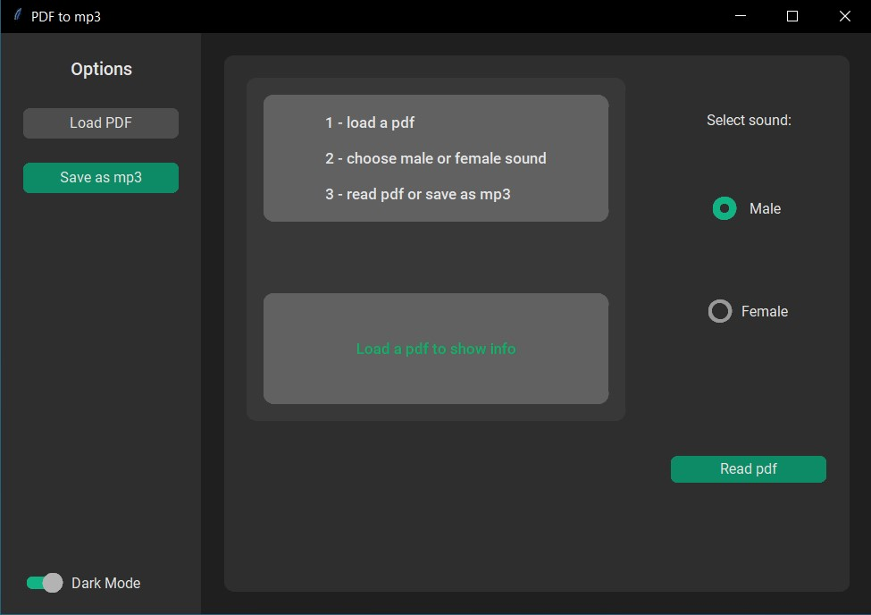
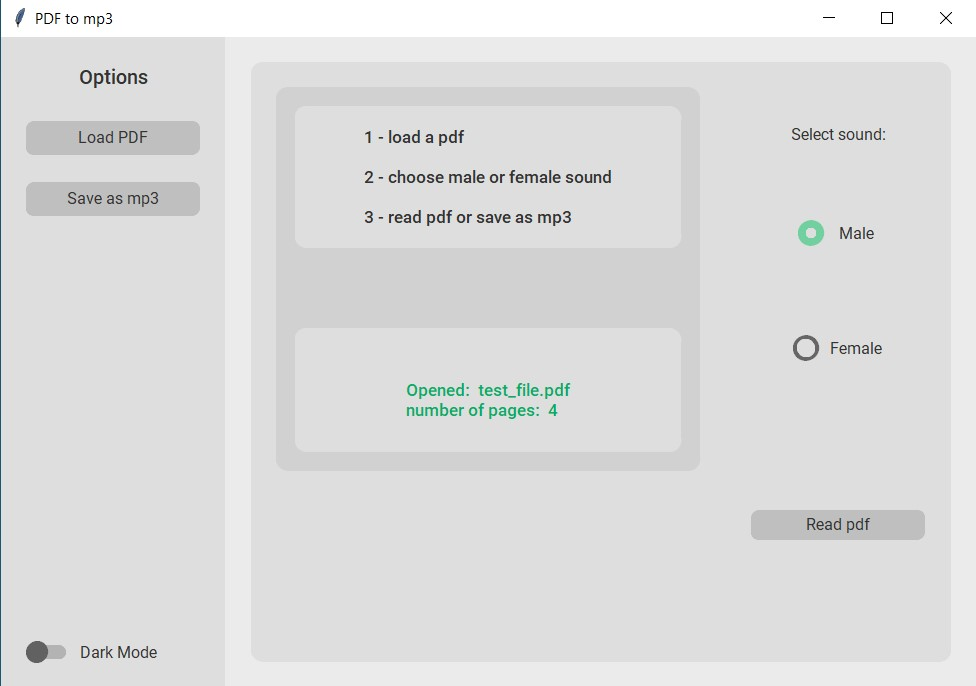
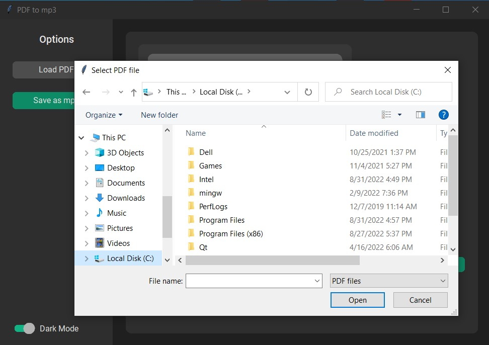
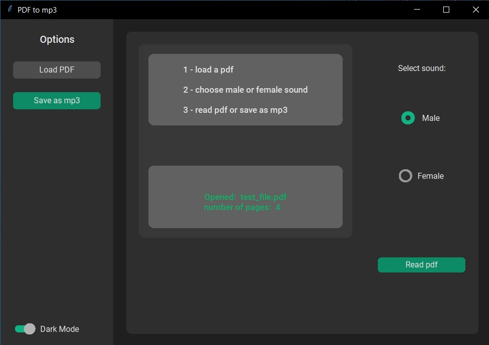
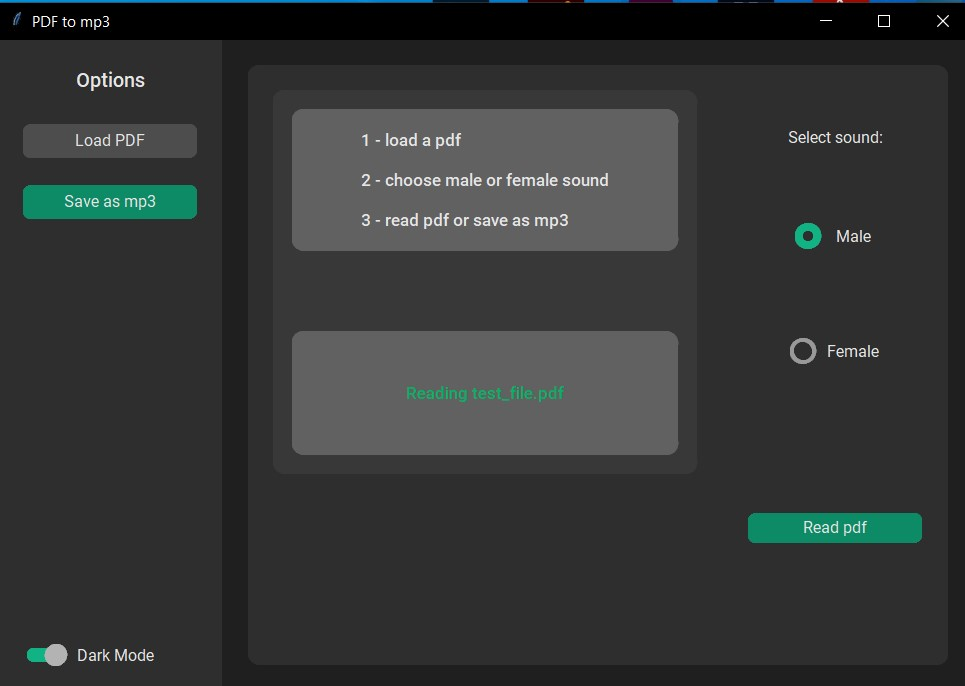
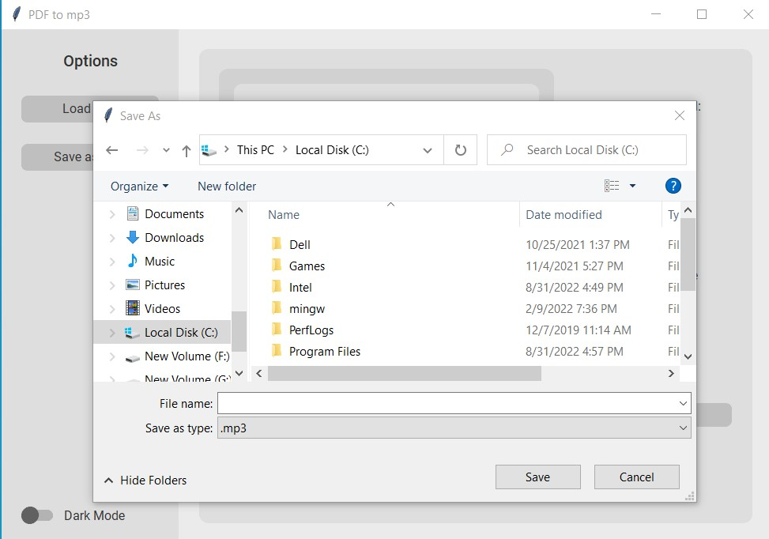
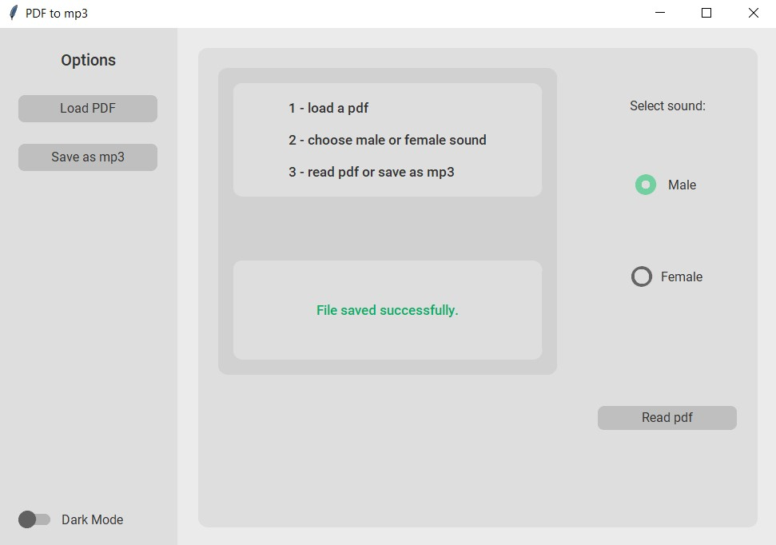

# pdf_to_mp3_app
## Convert PDF to mp3 (audiobook) - Python Desktop Application

### *Modules used:*

1- tkinter

2- customtkinter

3- PyPDF2

4- pyttsx3

5- threading

### *App functions:*

1- Dark/Light mode

 

 

2 - load pdf file

 

3 - choose male or female sound 

 

4 - read or save as mp3

 

 

 

